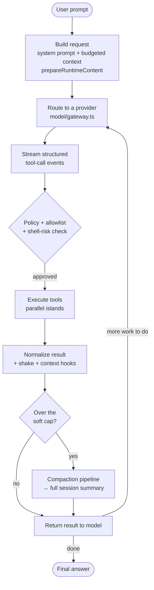
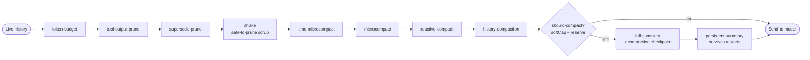

# ReaperCode

**A model-agnostic TypeScript coding agent built to survive long-horizon autonomous work** — layered context compaction, multi-provider routing, viewport-style file tools, and verified recovery.


Reaper is my testing ground for one question: **what does it actually take to keep a coding agent coherent across a very long session?** Most agents fall apart when the conversation outgrows the context window — they forget the task, re-read the same files, or hallucinate. Reaper is the pile of machinery that keeps that from happening. It's dogfooded daily, and most of what gets built here ends up ripped out again in the name of simplicity.

> **TL;DR** — Point it at a repo, give it a task, pick any provider. It plans, edits, runs tests, and verifies its own work — and it keeps going long after a normal agent would have run out of context.

---

## How a turn works

Every turn runs through the same loop in `runtime/engine.ts`:



The one rule that never changes: **the system prompt is never rewritten.** Only the surrounding history is compressed and rehydrated, so the agent's identity and instructions stay stable no matter how long the run gets.

---

## Context engineering, in one picture

This is the heart of the project. Before every model call, the live conversation flows through a layered hook chain (`runtime/context-engineering-wiring.ts`). Cheap prunes run first; the expensive LLM summary only fires when a single gate says the budget is actually blown.



Each layer is cheap-then-expensive: drop stale tool output, collapse superseded reads, then — only if still over budget — pay for a real summary that gets written to disk so the next run doesn't re-do the work.

---

## What's inside

| Capability | Why it matters | Where it lives |
|---|---|---|
| **Context engineering** | Runs for hours without blowing the context window. Old turns get pruned, summarized, and rehydrated — the system prompt is never touched. | `context/`, `runtime/context-engineering-wiring.ts` |
| **Prompt-cache-friendly cockpit** | Orders the request in a prefix-stable layout so the provider's prompt cache stays warm — cheaper, faster repeat turns. | `runtime/content-prep.ts` |
| **Proactive repo map** | Starts each task already knowing which files matter (PageRank-style ranking under a token budget) instead of blindly grepping. | `context/indexer.ts`, `graph.ts`, `ranking.ts`, `swe-pruner.ts` |
| **ACI file tools** | Viewport-style, line-numbered reads and edits that beat dumping whole files. 10 core tools ship by default; the rest are discovered on demand via BM25 search. | `tools/viewer/`, `tools/registry.ts` |
| **Parallel tool islands** | Safe reads and shells run concurrently without colliding on shared files. | `execution/scheduler.ts`, `tools/resource-keys.ts` |
| **Provider-agnostic routing** | One gateway, many providers: Anthropic, OpenAI, LiteLLM, DeepSeek, Cerebras, OpenRouter, MiniMax, NeuralWatt. Stuck streams get aborted automatically. | `model/gateway.ts` |
| **Verified recovery** | Catches hallucinations and forces the agent to re-derive claims from real artifacts before it calls something "done." | `verify/`, `recovery/` |
| **WAL / shadow checkpoints** | Flushes writes through a write-ahead log before mutating commands touch real state. | `recovery/wal.ts` |
| **Skills, hooks, extensions** | Customize behavior without forking the runtime. 17 built-in skills; first-class hook and extension subsystems. | `skills/`, `hooks/`, `extensions/` |
| **Internal task tracking** | A TodoWrite-style `createTask` / `updateTask` / `listTasks` API scoped per run, so the agent manages its own work list. | `tools/write/task.ts` |

---

## Quickstart

```bash
git clone https://github.com/gowtham-uj/ReaperCode.git
cd ReaperCode
npm install
npm run build

# Add a provider key (MiniMax shown; any supported provider works)
echo "MINIMAX_API_KEY=your_key_here" > .env

# Run a one-shot task
npm run reaper:exec -- "Analyze src/ and summarize the context-engineering layer" \
  --provider minimax --model MiniMax-M3
```

**Other handy scripts** (`package.json`):

| Script | What it does |
|---|---|
| `npm run reaper:exec -- "<prompt>"` | One-shot task run (the main entry point) |
| `npm run reaper:dev` | Watch-mode dev runner — rebuilds on change while you iterate |
| `npm test` | Node test suite |
| `npm run typecheck` | `tsc --noEmit` |
| `npm run stress` | Context-engineering stress harness |

Reaper loads provider keys from `./.env`, `~/.reaper/.env`, or `~/.hermes/.env`. Any provider in the catalog works — swap `--provider` / `--model` for Anthropic, OpenAI, DeepSeek, and the rest.

---

## Architecture in one breath

`runtime/engine.ts` owns the loop. Each turn:

1. **Build the request** — system prompt (`runtime/system-prompt.ts`) + budgeted context (repo map + skills + `AGENTS.md` + microcompacted history) via `prepareRuntimeContent`.
2. **Route** it through the model gateway to a provider.
3. **Stream** structured tool-call events back through the dispatcher.
4. **Guard** each tool through policy (`policy/sandbox.ts`, `governance/shell-risk.ts`), the allowlist, the result normalizer, and the parallel scheduler.
5. **Apply** `shake` + context hooks to the result.
6. **Return** the tool result to the model.
7. **On overflow**, fire the compaction pipeline; on hard cap, take a full session summary and rehydrate cleanly next turn — without ever touching the system prompt.

### Sub-agent delegation (in progress)

A delegation substrate exists at `orchestration/sub-agents.ts` (`runDelegatedPlan`) with depth limits, plan-cycle detection, sandbox workspaces, and file leases. The `subagent` skill-usage mode, `subagent_prompt` log kind, and `subagent_result` validation path are wired. A **user-facing swarm tool is planned but not shipped** — swarm reintroduction is deliberately deferred until the context layer is fully solid, because parallel agents amplify context bugs.

---

## Project status

| Area | State |
|---|---|
| **Context engineering** | Stable. Hard-cap stress runs green — 14/14 gates passing on the latest eval. |
| **Sub-agent architecture** | Substrate + hooks + logging in place; user-facing tool surface pending. |
| **Web UI** | Planned — a single-page cockpit for visual agent control. |
| **Offensive-security fork** | A red-team operator agent is being spun off this runtime in a separate repo. |

---

## Design philosophy

I've learned how *not* to build a coding agent in about 100 different ways. Most of what you see in `src/` is what survived that winnowing — the boring parts are boring on purpose. When a clever layer stops earning its keep, it gets ripped out. Simplicity wins over cleverness every time.

## Disclaimer

I maintain Reaper for as long as I personally use it. No guarantees. You're welcome to take the code and run.
