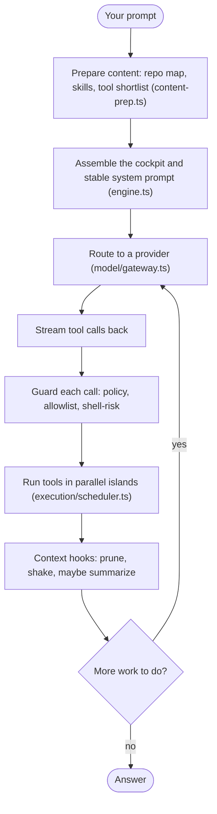
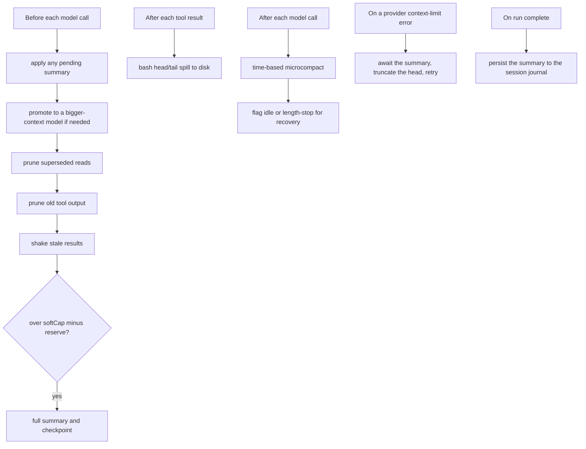

# ReaperCode

Reaper is my model-agnostic coding agent, written in TypeScript. I built it to do one thing well: keep working on a real task for a long time without falling apart when the conversation outgrows the model's context window.

Most agents lose the plot on long runs. They forget the original task, re-read the same files over and over, or start making things up once the history gets big. Reaper is basically all the machinery I've written to stop that from happening, plus a normal tool-using agent loop wrapped around it. I use it every day, and I rip things out of it just as often as I add them.


## What it does

You point it at a repo, give it a task, and pick a provider. It builds a picture of the codebase, plans, edits files, runs tests, checks its own work, and keeps going. The interesting part is everything that keeps it coherent across a long session.

- **Context engineering.** This is the core of the project. Before each model call the runtime prunes and compacts the conversation; only when it is genuinely over budget does it pay for an LLM summary. The system prompt is never rewritten, only the surrounding history gets compressed and rehydrated. More on this below.
- **Provider-agnostic routing.** One gateway (`model/gateway.ts`) talks to Anthropic, OpenAI, a LiteLLM gateway, DeepSeek, Cerebras, OpenRouter, the MiniMax OpenAI-compatible endpoint, and the NeuralWatt gateway (Kimi, GLM, Qwen). Streams get normalized into the same tool-call events, and a per-provider idle timeout kills a stuck stream instead of hanging.
- **ACI file tools.** `file_view`, `file_scroll`, `file_find`, and `file_edit` give the model bounded, line-numbered views and exact-range edits instead of dumping whole files. Ten tools ship in the model's default surface; everything else is discovered on demand through `search_tools` (BM25 over the tool catalog).
- **Proactive repo map.** On each turn it builds a codebase index and hands the model a budgeted, ranked map of the files that actually matter, so it does not start every task blind.
- **Parallel tool islands.** Safe reads and independent shells run at the same time without stepping on each other (`execution/scheduler.ts` plus per-tool resource keys).
- **Verified recovery.** The `verify/` modules (runner, judge, classifiers, contract coverage, semantic-failure, diff review) push back when the model claims something works without evidence, and `recovery/` keeps a write-ahead log and verified lessons so a failed step does not corrupt the workspace.
- **Skills, hooks, extensions.** 17 built-in skills plus first-class hook and extension subsystems, so you can change behavior without forking the runtime.
- **Its own task list.** A small per-run task API (`createTask` / `updateTask` / `listTasks` in `tools/write/task.ts`) so the model tracks its own work instead of leaning on the conversation.

## How a turn runs

The loop lives in `runtime/engine.ts`. Roughly:



Two things worth calling out. The system prompt (`runtime/system-prompt.ts`) is stable and never gets rewritten, which keeps the provider's prompt cache warm. And `prepareRuntimeContent` only prepares the raw material (the index, the budgeted repo map, skills, context files, the tool shortlist). The engine is what stitches those into the cockpit message the model actually sees.

## The context engineering

This is the part I've rewritten the most. It is not one linear pipeline, it is a set of hooks that fire at different points in the loop (`runtime/context-engineering-wiring.ts`). Cheap passes run first, and the expensive summary only happens when a single gate says the budget is blown.



The one rule I never break: a full summary replaces old conversation history, never the system prompt. When a summary fires it also writes a checkpoint to disk (`context/persistent-summary.ts`), so a resumed session does not re-do work the layers already did.

## Running it

You need Node (I run 22) and npm.

```bash
git clone https://github.com/gowtham-uj/ReaperCode.git
cd ReaperCode
npm install
npm run build

# Drop in a provider key. MiniMax shown, any supported provider works.
echo "MINIMAX_API_KEY=your_key_here" > .env

# Run a task
npm run reaper:exec -- "Analyze src/ and summarize the context-engineering layer" \
  --provider minimax --model MiniMax-M3
```

Keys are read from `./.env`, `~/.reaper/.env`, or `~/.hermes/.env`. Swap `--provider` and `--model` for Anthropic, OpenAI, DeepSeek, and the rest.

Handy scripts (`package.json`):

| Script | What it does |
|---|---|
| `npm run reaper:exec -- "<prompt>"` | Run a one-shot task. This is the main entry point. |
| `npm run reaper:dev` | Watch-mode dev runner, rebuilds while I iterate. There is no interactive TUI in this repo. |
| `npm test` | Node test suite. |
| `npm run typecheck` | `tsc --noEmit`. |
| `npm run stress` | Context-engineering stress harness. |

## Sub-agent delegation (not finished)

There is a delegation substrate in `orchestration/sub-agents.ts` (`runDelegatedPlan`) with depth limits, plan-cycle detection, sandbox workspaces, and file leases. The `subagent` skill mode, the `subagent_prompt` log kind, and the `subagent_result` validation path are all wired. What is not shipped is a user-facing swarm tool. I'm deliberately holding that back until the context layer is rock solid, because parallel agents multiply context bugs instead of adding them.

## Where things stand

| Area | State |
|---|---|
| Context engineering | Solid. Hard-cap stress runs pass, 14/14 gates on the latest eval. |
| Sub-agent delegation | Substrate, hooks, and logging are in. No user-facing tool yet. |
| Web UI | Planned. A single-page cockpit to watch a run. |
| Red-team fork | A separate operator agent is being spun off this runtime in its own repo. |

## Why it looks the way it does

I've built this loop wrong in about a hundred different ways. Most of what is in `src/` is just what survived. When a clever layer stops earning its place, it goes. The boring parts are boring on purpose, and I'd rather delete code than keep something I don't understand anymore.

## License

MIT. See [LICENSE](LICENSE). Take it and do whatever you want.

I maintain this for as long as I personally use it, so no promises.
