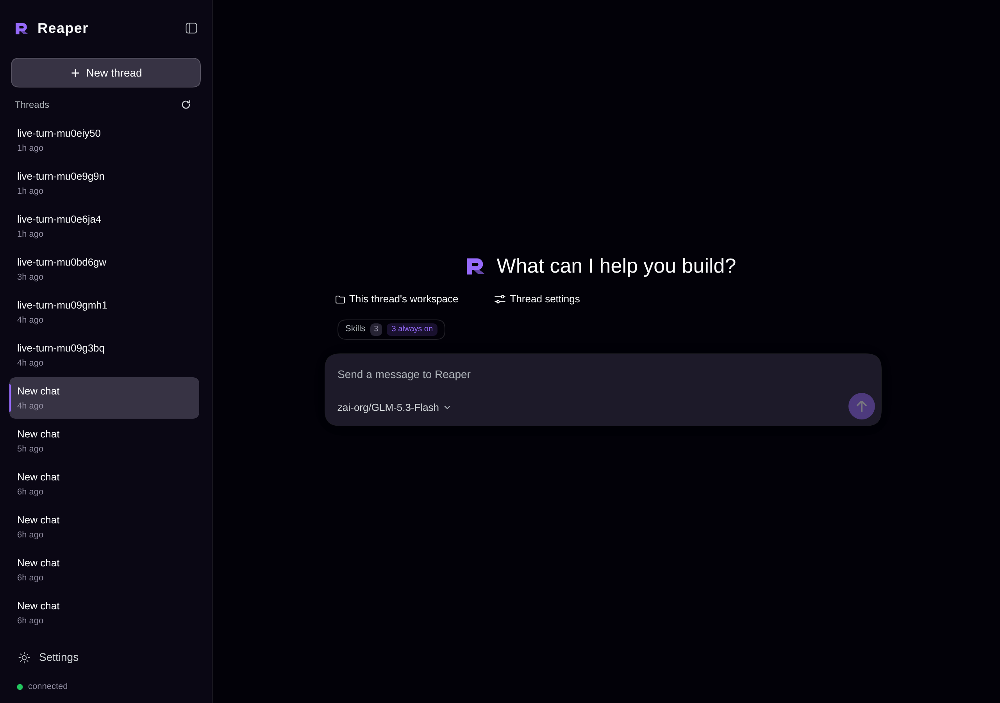
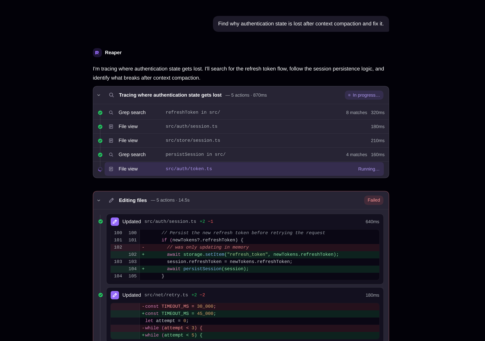
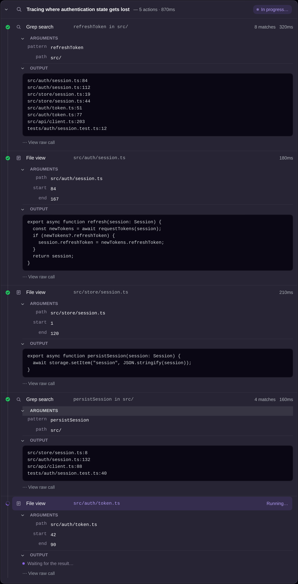
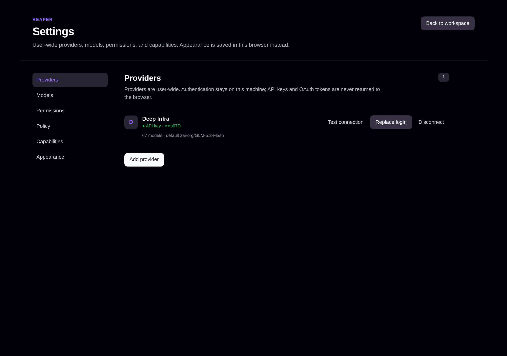
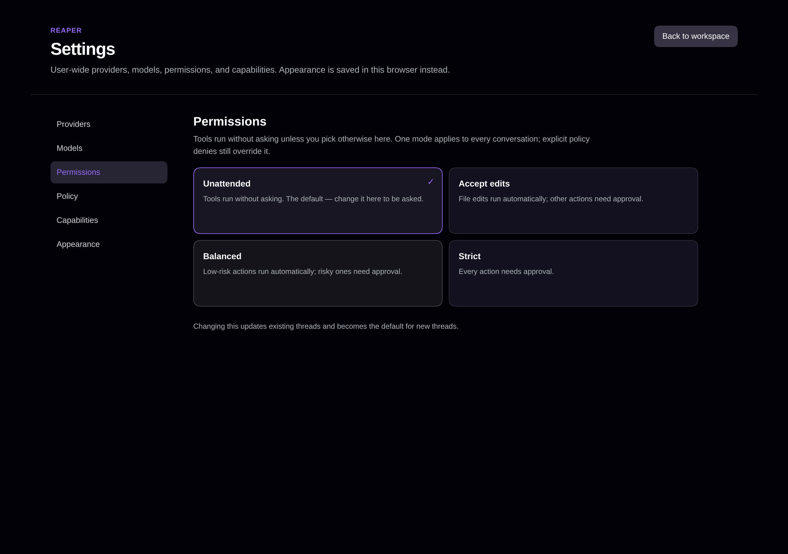
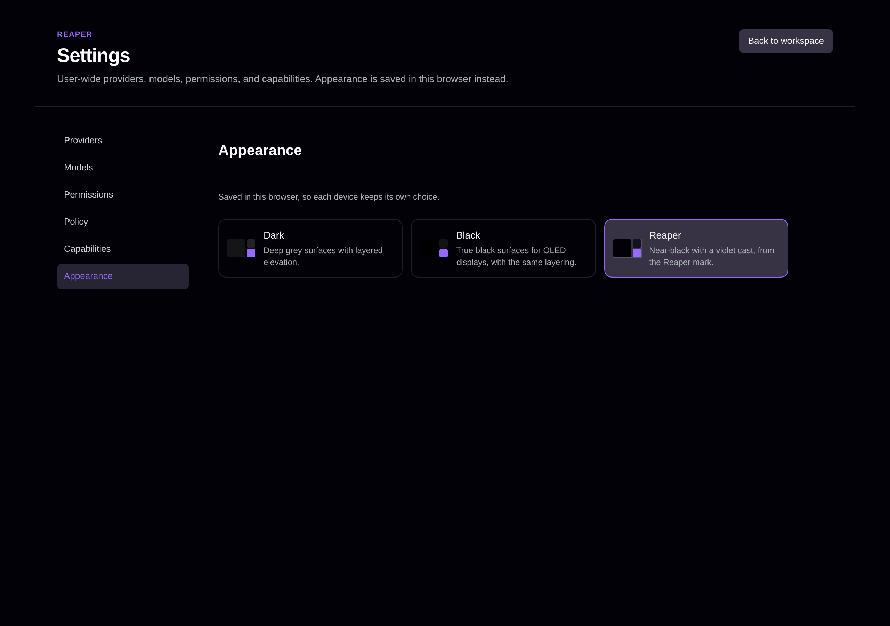
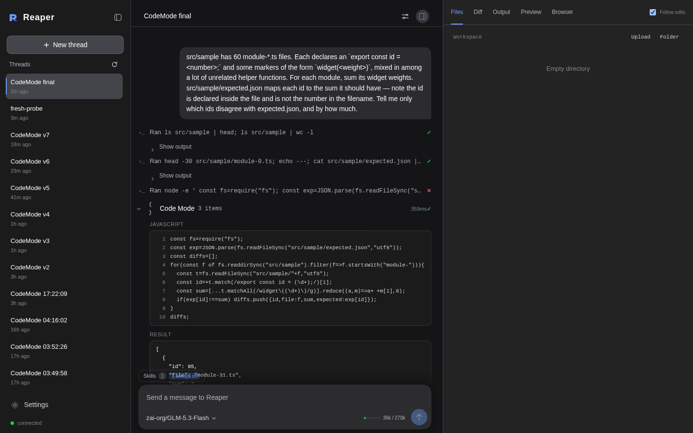
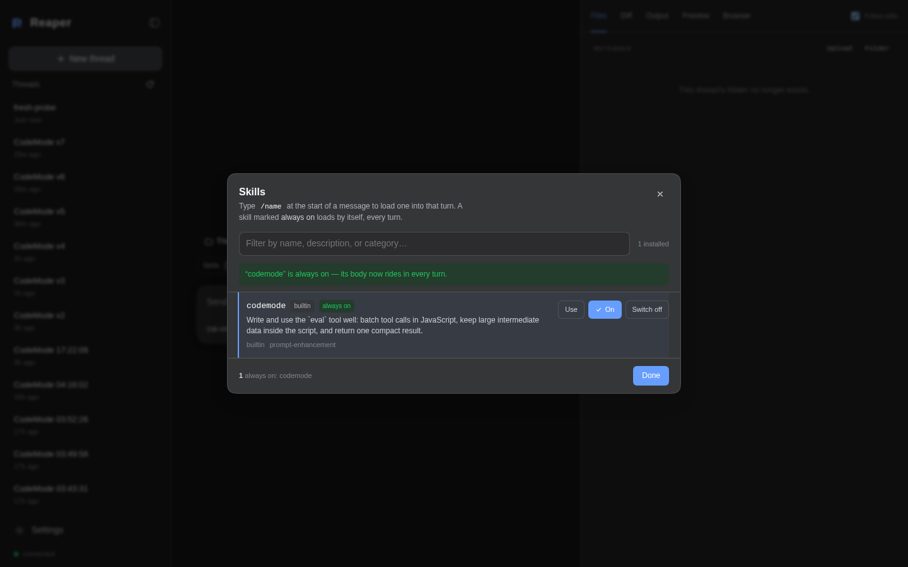

# ReaperCode


Reaper is a coding agent you run from the terminal. Point it at a repo, give it a task, pick a model. It reads files, edits them, runs shell commands, and keeps going until it thinks it is done.

It is built for long jobs. When the conversation gets large, Reaper trims old tool output and file reads, then summarizes only if the context budget is actually blown. The system prompt stays put. That is the whole point of the project.

Reaper can run as a CLI or through its React web interface. It is experimental. Use it on a copy of a project, or in a git repo you can revert.

## Install

You need Node 22 and npm (no build step, no `node_modules`. `reaper` ships as a single self-contained file).

### Install as a CLI (recommended)

The repo is public but not published to the npm registry, so install straight from the git URL. No auth is needed:

```bash
npm install -g git+https://github.com/gowtham-uj/ReaperCode.git
```

Then run it anywhere:

```bash
reaper exec run --prompt "Add a README section about setup" --provider minimax --model MiniMax-M3
```

### Build from source

```bash
git clone https://github.com/gowtham-uj/ReaperCode.git
cd ReaperCode
npm install
npm run build
```

Put a provider key in `.env` in the repo root:

```bash
echo "MINIMAX_API_KEY=your_key_here" > .env
```

Reaper also reads `~/.reaper/.env` and `~/.hermes/.env`. First file that sets a key wins. Existing environment variables are not overwritten.

## Run a task

```bash
npm run reaper:exec -- "Explain how authentication works in this repo"
```

Or call the binary yourself:

```bash
node bin/reaper exec run --prompt "Add a README section about setup" \
  --provider minimax \
  --model MiniMax-M3
```

Pass the prompt after `--prompt`, with `--prompt-file path`, or as leftover words after the flags.

By default the workspace is the current directory. Point it somewhere else with `--workspace`.

```bash
node bin/reaper exec run \
  --workspace /path/to/your/project \
  --prompt "Find flaky tests and tell me which ones"
```

## Web interface

The repository includes a React + Vite interface for threads, streaming turns, approvals, provider credentials, model selection, routed settings, and thread-scoped files, diffs, process output, previews, and browser surfaces.

Run the browser gateway and Vite server in separate terminals:

```bash
npm run web
REAPER_WEB_HOST=0.0.0.0 npm run web:ui
```

Open `http://localhost:5273`. Each new thread gets a fresh git-backed workspace under `~/.reaper/workspaces/<threadId>` unless you point it at an existing project folder.

### Each thread is confined to its workspace

Shell commands run inside a bubblewrap mount namespace that contains the
thread's workspace read-write, the system directories read-only, and nothing
else. A path outside the workspace does not resolve, because it is not mounted.
That covers the cases a command-text check cannot see: a path assembled at
runtime, a symlink, a script file, and anything a program the command started
goes on to open. The sandbox root is read-only, so a stray write outside fails
with `Read-only file system` rather than landing invisibly on a throwaway
filesystem and reporting success.

Network access is unchanged. This is a filesystem boundary, not an egress
policy: the agent still installs packages and calls APIs.

It is on by default for every thread. Turn it off per thread under **Thread
settings → Workspace sandbox**, which applies to the next command, including
during a turn already running. From the CLI, `--sandbox on|off`; omitting the
flag leaves the thread's stored setting alone, so a `--session` run does not
reset what the UI configured.

On a host without user namespaces (bubblewrap cannot create one), Reaper falls
back to inspecting the command text and says so rather than claiming a
confinement it does not have.

### What it looks like

A new thread opens on the composer, with the workspace and settings for that thread one click away. Threads live in the sidebar; each one keeps its own workspace and its own transcript.



Send a message and the agent works in the transcript. Tool calls are grouped into a step card titled with what the step is doing, and each call is one row: what it was, what it ran on, and how long it took. The row that is still running is filled, so you can find it without reading.



An edit opens to show the diff, with both line-number gutters. Added and removed lines are tinted; the counts next to the path are the real totals, so a change too large to send in full still reports its true size and says it is a preview.



Settings are separate routed pages under `/settings`, not a modal. Providers hold write-only credentials: a key you save is never sent back to the browser, only a hint like `••••s67D`.



A provider configured by an environment variable has no Disconnect button, because there is no stored key to remove. The row says which variable is in use and what would actually end the connection, rather than offering a button that does nothing.



Three themes ship, all dark. `Reaper` is the default and takes its palette from the brand artwork: measured from the image itself rather than picked by eye, so every surface sits in one violet hue at low saturation and the accent is the only saturated thing on screen.



### How a turn works

1. **You send a message.** It goes to the app-server as a turn. The transcript shows your message immediately, then the agent's reply as it streams.
2. **The model answers with text, tool calls, or both.** Text streams into the transcript as it arrives. Reasoning, when a model sends it on its own channel, is kept separate from the answer rather than mixed into it.
3. **Tool calls run and report back.** Each call is one row, and a run of them collects into a step card. Rows update in place: a call that starts as `Running…` becomes a duration and a green mark without the transcript reordering.
4. **Edits show their diff.** The diff is derived from the tool call itself, not by re-reading the file, so it says what that call changed rather than what the file looks like now. A call that replaced a line shows the removal, not just the addition.
5. **Anything risky waits for you.** Depending on the permission mode, a call that writes or runs a command pauses and asks. The approval appears inline and as a bar above the composer, so it cannot be missed if you have scrolled away.
6. **The turn ends, or it keeps going.** If the model stops without producing text or a tool call, Reaper nudges it a few times and then says why it gave up instead of leaving an empty reply. Reasoning-only stops are nudged separately rather than counted as empty.
7. **When context fills, Reaper trims first.** Old tool output and file reads are dropped before anything is summarized, and the system prompt is left alone. The context meter shows what is actually being used.

The transcript is the primary surface, and it is built to be read rather than skimmed: activity clusters collapse, raw payloads stay behind a disclosure, and a jump-to-latest control appears when you scroll away from a running turn.

### UI source credit

The web interface is based on and adapted from the React web UI in [DeepSeek Harness](https://github.com/deepseek-ai/deepseek-harness), primarily its theme, layout, sidebar, conversation, chat, approval, model-selection, workspace, and settings packages. Reaper adds its own persistent application provider, JSON-RPC app-server integration, thread/workspace model, routed settings, and agent surfaces. DeepSeek Harness is Copyright (c) 2026 DeepSeek and licensed under the MIT License; the vendored source and original license are preserved under `web/ui/upstream/deepseek-harness`, with an adaptation notice under `web/ui/src/deepseek`.

### Catalog data

The provider catalog is a checked-in snapshot of [Models.dev](https://models.dev), refreshed by `npm run sync:transports`. Reaper does not copy service credentials and does not imply vendor endorsement; every provider is configured by the user, and a model is offered for a turn only when its transport is present in this build.

## WebSocket app server

Run Reaper as a persistent JSON-RPC 2.0 server:

```bash
reaper app-server --listen ws://127.0.0.1:0 --workspace /path/to/project
```

The first stdout line is a machine-readable ready record with the port chosen by the OS:

```json
{"type":"reaper.app-server.ready","protocolVersion":1,"url":"ws://127.0.0.1:43127/","healthUrl":"http://127.0.0.1:43127/healthz","pid":12345}
```

Loopback listeners can run without authentication. A non-loopback listener refuses to start unless you pass a bearer token. Browser WebSocket connections are rejected by default because they send an `Origin` header.

```bash
reaper app-server \
  --listen ws://0.0.0.0:8787 \
  --auth-token-file ~/.reaper/app-server-token \
  --max-concurrent-turns 2
```

Clients send the token as `Authorization: Bearer <token>` during the WebSocket upgrade. Reaper never writes this token into thread metadata or journals.

Every connection must initialize before calling another method:

```json
{"jsonrpc":"2.0","id":1,"method":"initialize","params":{"protocolVersion":1,"clientInfo":{"name":"my-ui"}}}
```

Start a persistent thread, then start a turn:

```json
{"jsonrpc":"2.0","id":2,"method":"thread/start","params":{"threadId":"fix-auth","provider":"openai","model":"gpt-5.4","subscribe":true}}
{"jsonrpc":"2.0","id":3,"method":"turn/start","params":{"threadId":"fix-auth","input":[{"type":"text","text":"Find and fix the authentication race"}]}}
```

The server sends assistant text, reasoning, tool lifecycle, and command output as separate notifications while the turn is running. It uses Codex-style item shapes and methods such as `item/started`, `item/agentMessage/delta`, `item/reasoning/textDelta`, `item/commandExecution/outputDelta`, `item/completed`, and `turn/completed`. `item/completed` carries the authoritative final item, while delta notifications carry only the text or output to append.

Threads outlive WebSocket connections. Disconnecting removes that client's subscription but does not stop the turn. Reconnect with `thread/resume` and an `afterSequence` offset to replay the bounded in-memory event window. Use `thread/read` to load persisted conversation history after a process restart.

```json
{"jsonrpc":"2.0","id":4,"method":"thread/resume","params":{"threadId":"fix-auth","afterSequence":120,"subscribe":true}}
{"jsonrpc":"2.0","id":5,"method":"turn/steer","params":{"threadId":"fix-auth","turnId":"turn-id-from-start","message":"Also add a regression test"}}
{"jsonrpc":"2.0","id":6,"method":"turn/interrupt","params":{"threadId":"fix-auth","turnId":"turn-id-from-start"}}
```

Steering is applied at the next model-loop boundary. It does not alter a provider request already in flight.

Reaper threads use `yolo` permission mode by default, matching `reaper exec run`. Normal tools do not ask for approval in this mode, though hard-deny safety rules still apply. A thread started with `strict`, `auto`, or `accept_edits` can receive server-initiated approval requests such as `item/commandExecution/requestApproval`. The client answers with the same JSON-RPC id:

```json
{"jsonrpc":"2.0","id":"server-request-id","result":{"decision":"accept"}}
```

A timeout, interrupt, thread closure, or reviewer disconnect never auto-approves a pending tool.

## Providers

Reaper has two provider paths, and they have different scopes.

The **web UI and app-server** route everything through a Models.dev catalog: 213
providers and roughly 7,500 models, resolved at turn time to one of 29 installed
Vercel AI SDK transport packages. Which providers you can actually run is decided
by authentication and transport coverage, not by a hardcoded list, and the
generated coverage table lives in `src/model/provider/TRANSPORTS.md`. A catalog
entry with no installed loader is listed but not offered for turns.

A thread that has never had a model chosen runs on the first provider you
connected, at that provider's catalog default, so a new chat works as soon as
a key is stored, without pinning a model first. The composer shows that model,
because it is the one that will answer. An expired credential and a provider
this build cannot send to are both skipped rather than selected, and a thread
you have pinned keeps its own choice.

The **CLI** (`reaper exec run`) is the narrower path, and this is the list it
accepts:

| Provider | Put this in `.env` | Default model |
|---|---|---|
| `anthropic` | `ANTHROPIC_API_KEY` or `ANTHROPIC_AUTH_TOKEN` | the provider's |
| `openai` | `OPENAI_API_KEY` (`OPENAI_MODEL` overrides) | the provider's |
| `minimax` | `MINIMAX_API_KEY` | `MiniMax-M3` |
| `deepseek` | `DEEPSEEK_API_KEY` | `deepseek-flash` |
| `nuralwatt` | `NURALWATT_API_KEY` | `kimi-k2.7-code` |
| `nuralwatt2` | `NURALWATT_API_KEY2` | `kimi-k2.7-code` |

Any of these also accepts `ANTHROPIC_AUTH_TOKEN`, which is what makes an
Anthropic-compatible proxy work. A provider name outside this list is refused
with the list printed, not silently replaced with a default.

The two paths are meant to converge. A provider the web UI can run but the CLI
cannot is a gap, not a design, and `buildConfigForProvider` already exists to
resolve a provider from the catalog the same way the app-server does.

## Useful flags

```bash
node bin/reaper exec run --prompt "..." \
  --provider anthropic \
  --model claude-sonnet-4-6 \
  --workspace . \
  --session my-task \
  --sandbox on \
  --timeout-ms 600000 \
  --reasoning-effort medium
```

| Flag | What it does |
|---|---|
| `--prompt` | The task |
| `--prompt-file` | Read the task from a file |
| `--provider` | Which API to call |
| `--model` | Which model id to use |
| `--workspace` | Directory the agent works in |
| `--session` | Keep a named journal so you can continue later |
| `--sandbox` | `on` or `off` for the workspace confinement (default on; omit to keep the thread's stored setting) |
| `--timeout-ms` | Cap on the whole run |
| `--reasoning-effort` | `low`, `medium`, or `high` on OpenAI-compatible providers |
| `--thinking` | `on` or `off` for any provider (default `on`) |
| `--json` | Print the result object instead of live text |
| `--stream-events` | JSONL events on stdout, extra notes on stderr |

`--session name` writes turns to `.reaper/sessions/name/session.jsonl` and reloads them the next time you use the same name. `.reaper/logs/name` is still read if a session already lives there, so an older journal keeps working.

## What it can do

On every turn the model gets file and shell tools: look at a file, search, edit a range, write or delete a file, list a directory, grep, and run bash. Extra tools exist behind `search_tools`, including git checkpoints. Browser and desktop-control tools exist but stay off unless you turn them on. The model can also write and run a program instead of making calls one at a time. See [Code Mode](#code-mode).

It will install packages, run tests, and change your working tree. That is the product. Keep git clean enough that you can undo it.

Long runs stay inside a 270,000-token context budget. How that works is
[below](#context-management).

## Context management

The task is the easy part. The hard part is finishing it on the four hundredth
turn, after the agent has read sixty files, run a build that printed nine
thousand lines, and rewritten the same module four times.

That is what this section is for. An agent does not fail because it cannot edit
a file. It fails because by the time it knows what to do, the thing it needed to
remember has been pushed out of the window by everything it did to find it. The
goal drifts: it re-reads a file it already understood, retries a command it
already ran, or answers a question three steps old. The work is done and the
task is not.

So Reaper treats the window as a budget to be spent rather than a bucket to
fill. Large files never enter it whole, a build log becomes a path plus a head
and tail, and a tool result that a later call superseded is dropped rather than
carried. What stays is the task, the plan, the decisions, and whatever the
current step actually needs. That is what lets a run keep going for days and
still be working on the thing you asked for.

Fourteen techniques, cheapest first, each reporting what it reclaimed:

| technique | what it does | default |
| --- | --- | --- |
| `prompt_spill` | A pasted prompt beyond 20K characters is written to `.reaper/pastes/` and the model is handed the path instead of the text | on |
| `bash_head_tail` | A command's output beyond a few KB never enters the conversation; the complete output goes to disk and the model is told the path | on |
| `supersede` | Drops an earlier read of a file once the same file has been re-read unchanged | on |
| `tool_output_prune` | Truncates aged tool output outside a recent-protection window | on |
| `shake` | Replaces stale tool results with placeholders, keeping file reads unless a later read proves them stale | on |
| `microcompact` | Clears repeated identical shell output after an idle gap | on |
| `tool_history` | Summarizes a run of middle tool results, keeping the newest in full | on |
| `full_summary` | Calls a model to rewrite the middle of the conversation | on |
| `handoff_summary` | The same, with a prompt tuned for smaller-context models | off |
| `snapcompact` | Collapses consecutive image blocks | off |
| `idle_compaction` | Compacts proactively while the session is idle | off |
| `incomplete_recovery` | Compacts after a turn stopped on `max_output_tokens` | on |
| `ptl_recovery` | Drops the oldest turns when the provider rejects a request as too long | on |
| `model_promotion` | Switches to a sibling profile with a larger window instead of compacting | on |

Each one appears in the transcript as it runs, with what it reclaimed:

In the web transcript:

```
● Trimmed stale output    −1.0MB    52 aged tool outputs truncated
● Moved output to disk    −28k      read it at /…/artifacts/processes/call-9.log
● Summarized conversation −940k     40 → 6 messages
```

In the terminal, the same events with the same words:

```
  ◆ Summarized conversation — saved 940k characters · 40 → 6 messages
  ◆ Moved output to disk — saved 28k characters · read it at /…/artifacts/processes/call-9.log
  ◆ Trimmed stale output — saved 1.0MB · 52 aged tool outputs truncated
  ◆ Switched to a larger model — glm-5.3-flash → glm-5.3-long (270k → 1M window)
```

Reproduce that output with
`node --import=tsx scripts/context-management-drive.mts`, which drives every
technique to its threshold and prints what it reclaimed.

The CLI prints the same lines with the same words, because both read one label
vocabulary (`web/shared/src/summarize.ts`). Every completed reclamation is also
appended to `.reaper/compaction-savings.jsonl`, so a session's context history is
readable after the fact.

Turn the off-by-default ones on in `.reaper/config.json`:

```json
{ "contextManagement": { "handoffEnabled": true, "idleEnabled": true } }
```

### What a large file does

A file far bigger than the window is handled by never letting it in. Measured on
a 94MB log analysed by a live model through the real engine: 10 tool calls, the
largest thing that entered the conversation was 2,194 characters, and the answer
was correct. `cat` on that file returns a 2.7KB preview and writes the rest to
disk, 42,734,826 bytes in the process log, with a notice naming the complete
path so the model can `grep_search` it if it needs more.

```bash
# both drives: one scripted, one where the model chooses the commands
node --import=tsx scripts/context-management-drive.mts
REAPER_LIVE_TESTS=1 node --import=tsx scripts/big-log-live-drive.mts
```

### What a large paste does

A user pasting a hundred thousand characters into the composer used to put all of
it in the first message, and the context was spent before the agent had done
anything. Measured: an 842,845-character paste reached the provider as 432k
tokens in the opening turn, over the model's window, and the run could not start.

Now a prompt over the spill threshold (20K characters, about 5K tokens) is
written to `.reaper/pastes/<timestamp>-<id>.txt` and the model receives a short
reference naming the file and the first part of its text, with an instruction not
to ask for it again. The paste never enters the conversation; the model reads it
with the file tools if and only if the task needs it. A 118,447-character paste
against the live stack left the context at 31,474 tokens and the model still
returned the one line buried at the end of it. The threshold is
`contextManagement.promptSpillChars`; set it to `0` to disable the spill.

## Code Mode

Code Mode is a tool called `eval`. It hands the model a real Node.js runtime and
lets it write a program instead of making one tool call at a time.

```js
const { matches } = await tools.grep_search({ pattern: "TODO", include: "*.ts" });
const byFile = {};
for (const match of matches) (byFile[match.path] ??= []).push(match.line);
Object.entries(byFile).map(([path, lines]) => ({ path, count: lines.length }));
```

The last expression is the result. `await` works at the top level. The forty file
bodies never leave the script, so the model gets the count and the paths that
mattered.

### Real Node, inside the workspace

`fs`, `child_process`, `fetch`, `node:*` builtins, npm packages, and genuine
parallelism all work. That is deliberate: the model kept writing
`await import('node:fs')` because that is what JavaScript that does real work
looks like, and a runtime that refuses it is a runtime the model works around.

A script runs in the same bubblewrap mount namespace a `bash` command gets, so it
sees its thread's workspace and the read-only system directories, and nothing
else. Two consequences, and the difference between them is worth being exact
about because an earlier version of this file was not.

The workspace is mounted read-write and is what a relative path resolves against.
Anything outside the workspace that is not a system path is unmounted: from a
workspace at `/tmp/ws-abc`, `fs.existsSync("/work")` is `false`, and another
thread's files are unreachable the same way.

The system paths are mounted **read-only, on purpose**: `/usr`, `/bin`, `/lib`
and `/etc` are what let a dynamic linker, DNS and TLS work at all, so
`/etc/passwd` is readable. That is not a leak and it is not private either. The
same is true of `bash` in this repository, so the three agree.

`/tmp` is writable and persists between turns, the same as
for `bash`. On a host where bubblewrap cannot run, the script falls back to a
thread of the Reaper process and the result carries `sandboxed: false` so the
difference is visible rather than assumed.

A script that reads a file through `node:fs` still bypasses the permission
checks, approval prompts, and audit log that `tools.*` goes through; the mount
namespace is what bounds it to the workspace. `tools.*` remains the better path
when a tool does the job, which is why the description tells the model so.

Two things are refused on top of the mount boundary: writing to system
directories and reading credential stores like `~/.ssh` or `~/.aws`, and
commands like `rm -rf /`, `mkfs`, `dd of=/dev/sda`, and fork bombs. A refusal
comes back as a catchable `REAPER_REFUSED` error naming the operation, not the
model's code.

Liveness is what a worker thread buys: `while (true) {}` is killed instantly,
memory is capped by V8, a synchronous child process cannot outrun the deadline,
and a script that starts a background process has it collected when the turn
ends, the same lifetime a `bash` child gets.

### Every tool, without the context cost

A script can call **every tool the agent can call**, all 30 of them, including
the 19 whose schemas are not in the model's context:

```js
const found = await tools.search_tools({ query: "find files matching a pattern" });
const { input } = await tools.describe("glob");   // -> { pattern, path }
const { files } = await tools.glob({ pattern: "src/**/*.ts" });
```

`eval` itself is the one exception, because a script calling itself nests one
timeout budget inside a runtime the level above cannot interrupt.

The tool catalogue is not in the prompt. It travels into the worker, and the
model reaches into it on demand, so `eval`'s cost is the same whether Reaper has
thirty tools or three thousand:

| | tokens |
| --- | --- |
| `eval` tool description (fixed) | ~484 |
| full catalogue, inside the sandbox | ~2,549 |
| the deferred-tools list in the system prompt | ~706, at ~35 per tool per turn |

That last row is why the list is capped: extensions register into the same
registry, so it grows without bound otherwise. Past 24 names the rest are
summarised as `… and N more`, with a pointer at both ways to search. The elision
is stated rather than silent, because a truncated list that reads as complete is
worse than the long one it replaced.

### In the web interface

When the model writes a program, it renders as its own block in the transcript.
The script appears with line numbers, and the Reaper tools it called sit
underneath:



While it runs, output streams into the block live rather than showing a spinner,
so a loop over sixty files is visible as it happens.

### The `codemode` skill

`eval`'s description is the routing logic and stays short. The worked detail
lives in the `codemode` skill: return semantics, the `tools.*` API, the refusal
codes, and seven example shapes. The model loads it with `activate_skill` when it
wants it. A skill is a document, so loading it costs context only in the turns
it is used.

```bash
/skills                     # list installed skills
/skills show codemode       # read the body
/skills pin codemode        # always-on: its body rides in every turn
/skills unpin codemode
```



`/skills` works in the CLI and in the web UI, both accept a filter, and both show
what is pinned. Pinning is per user, not per thread: a skill marked always-on
rides in every turn of every conversation until it is switched off.

### In the terminal

Code Mode renders as its own block: the script with line numbers, the inner
Reaper tool calls as they happen, and the value that came back:

```text
  → Eval — const { matches } = await tools.grep_search({ pattern: 'TODO' }); (+1 lines)
      const { matches } = await tools.grep_search({ pattern: 'TODO' });
      matches.length;
    Grep search · → 3 · 412ms
```

The inner tools are named rather than counted. "3 tool calls" says how busy the
script was; "Grep search, File view ×2" says what it did, which is the question
the line is there to answer. Both this line and the web row read their labels
from `web/shared/src/summarize.ts`, so a terminal and a browser describe one call
with the same words.

The web transcript shows the same thing with live streaming output while the
script runs, so a long loop is visible rather than a spinner.

## Architecture

Reaper is a single agent loop with a lot of machinery around context, tools, and providers. The CLI is thin. Almost all of the design lives under `src/runtime`, `src/context`, `src/tools`, and `src/model`.

```text
prompt + workspace
        |
        v
   exec runner          builds provider/model config, checks the API key
        |
        v
   runtime engine       state machine for one task
        |
        +-- model gateway ---- Anthropic messages API
        |                   +- OpenAI-compatible chat API
        |
        +-- tool dispatch ----- file tools, bash, search_tools, ...
        |
        +-- context hooks ----- prune, shake, microcompact, full summary
        |
        v
   stop when the model returns no more tool calls
```

### The loop

The engine is a graph, not a `while (true)` with a pile of special cases. A run starts by bootstrapping the workspace and writing down a short task contract. Then it prepares content once: a workspace sketch, the skill catalog, and the tool shortlist. After that it enters the live loop.

Each turn does the same four things:

1. Call the model with a stable system prompt, a "cockpit" user message, the compacted history, and the current tool list.
2. Take the streamed tool calls and run them through validation, policy, and optional PreToolUse hooks.
3. Execute independent calls in parallel. Conflicting calls wait. File edits go through a write-ahead log so a half-finished mutation can roll back.
4. Fold the results back into history, drop reads that a later read replaced, and maybe compact.

The model stops the run. If it returns a final message with no tool calls, the engine summarizes metrics and exits. Reaper does not run a separate judge on the main path. If the model ran tests or a typecheck, that output is treated as evidence. That is a deliberate choice: the expensive verification stack exists for delegated sub-agents, not for every local `exec run`.

### Why the system prompt never changes

Providers cache prefixes. If you rewrite the system prompt every turn, you pay for it every turn. Reaper builds `MAIN_AGENT_SYSTEM_PROMPT_TEXT` once and leaves it alone. What the model needs to know about *this* run goes in a cockpit user message: workspace, skills, tool shortlist, the task.

When context gets tight, Reaper compresses history. It does not touch the system prompt. A resumed `--session` reloads a journal and any saved summary. It does not rebuild the prompt from scratch and hope the cache still hits.

### Tools are small on purpose

Dumping whole files into the model is how long runs die. The default file tools are bounded:

- `file_view` gives a line-numbered window of a file
- `file_find` searches inside one file
- `file_edit` replaces an exact range

Eleven tools carry a full schema on every call: `bash`, `file_view`, `file_edit`, `write_file`, `grep_search`, `list_directory`, `glob`, `git_status`, `git_diff`, `eval`, and `search_tools`. The other nineteen ship as one line each, just a name and a description, and are hidden behind `search_tools`, which is BM25 over the tool catalog. The model asks for a capability when it needs one instead of carrying every schema forever.

`search_tools` is in the core set because it is the escape hatch the other nineteen depend on. `delete_file` and `file_find` are not: deleting is rare and irreversible enough to deserve a discovery step, and `file_view` with an explicit range already covers what `file_find`'s viewport did. The full list is generated into `tools.md`.

Independent reads and shells run at the same time. The scheduler keys each tool by the resource it touches, so two reads of different files proceed and two writes to the same file do not.

### Context budget

The hard cap is 270,000 tokens. Soft cap defaults to that. Counts are `chars / 4`. That is crude and good enough to decide when to spend money on a summary.

Cheap passes run first, on every turn:

- a later read of the same file version replaces the earlier one
- old tool output outside a protect window gets shaken out
- bash output can spill to disk so only a head and tail stay in context

Only when those passes are not enough does Reaper pay for an LLM full summary. That summary replaces old conversation, writes a checkpoint, and becomes what a later session rehydrates. A provider "context length exceeded" error does the same path, or truncates the head if a summary is not ready.

The design bias is: do not summarize until you have to. Summaries lose detail. Pruning a stale `cat` does not.

### Providers

The loop does not speak Anthropic or OpenAI. It speaks one gateway, `ProviderModelClient`, and every wire format is normalized behind it. Streams come back as the same tool-call events regardless of who produced them, and a stuck stream dies on an idle timeout instead of hanging the run.

Behind that boundary sit two things. The AI SDK transports carry the catalog: 29 pinned provider packages covering the 213 providers in the Models.dev snapshot, each resolved from the selected model's npm identity, with per-call credentials so two threads on different providers never race each other's keys. In front of them sits provider authentication (API keys, environment variables, and the OAuth and device flows that some vendors require), plus the request transformations each vendor needs for reasoning, caching, and tool calling.

A model the catalog advertises but this build has no package for fails with a sentence naming the package and the model you picked, rather than a module error from inside the loader. `TRANSPORTS.md` is generated from the pinned snapshot and CI fails if it drifts.

### Recovery and the things that are not shipped

Edits are journaled. A failed mid-file mutation should not leave the workspace half-written. Named sessions persist turns so you can continue tomorrow.

There is a sub-agent runner with depth limits, sandbox workspaces, and file leases. It is not exposed as a user tool. Parallel agents multiply context bugs. The context layer has to be boringly correct first.

MCP was removed. Skills, hooks, and extensions are the supported way to change behavior without forking the runtime.

## Other commands

`node bin/reaper --help` prints the groups.

```text
reaper skill list
reaper memory list
reaper extensions list
```

Skills are extra instructions Reaper can load for things like debugging or repo exploration. Memory and extensions are optional. You do not need them for a first run.

## Tests

```bash
npm test                # the whole server suite
npm run test:web        # the React UI
npm run typecheck       # server + web
```

Two suites drive Code Mode directly: `tests/unit/code-mode.test.ts` covers
execution, the resource limits, and the guard, and
`tests/unit/code-mode-surface.test.ts` covers what a script can reach. That is
the whole registry, the discovery flow, and plain-Node execution beside
`tools.*`.

Two live harnesses sit outside CI, because they need a real model and the tool
choice they measure is a decision rather than a fact:

```bash
REAPER_LIVE_TESTS=1 node --import=tsx scripts/browser-codemode-skills.mts
REAPER_LIVE_TESTS=1 ROUTING_REPEATS=3 node --import=tsx scripts/code-mode-routing.mts
```

The first drives the whole UI in a real browser and screenshots every step. The
second puts five task shapes in front of the model and records whether it
reached for a program or a tool, which is the only way to check the wording of
`eval`'s description. There is no router or classifier behind it.

`npm run reaper:dev` watches the CLI while you hack on it. `npm run stress` is a context-budget harness, not a user command.

## What to expect

- No interactive TUI. Use the CLI for one-shot runs or the React web interface for persistent threads.
- No MCP servers. That path was removed.
- No multi-agent swarm you can invoke. Parallel tool calls exist. A user-facing delegate tool does not.
- Several scripts under `scripts/` are old eval harnesses. Use `bin/reaper` or `npm run reaper:exec`.

## License

MIT. See `LICENSE`.
