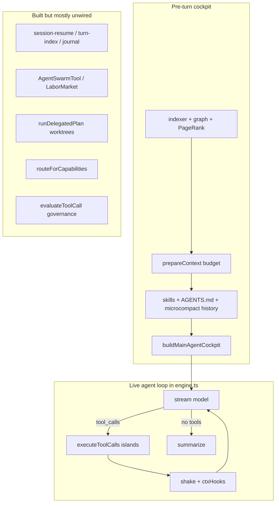

# Reaper Coding-Agent Audit — vs Pi / OMP Context Engineering

> Scouted 2026-07-09 against current `main` (`v0.1.45: complete OMP context-engineering port`).
> Benchmarks: Pi / Oh-My-Pi (OMP), Claude Code, Aider, Cursor-style cloud agents.
> Scope: context engineering first, then agent loop / tools / memory / subagents.

---

## Verdict

Reaper already has a **strong OMP-aligned compaction stack** (21 wired layers, shake validated under stress, progressive tool disclosure, ACI file viewer). It is **not yet a great coding agent** because too much of the soft context layer is **built but unwired**, the hot path is concentrated in a 6k-line `@ts-nocheck` engine, and several Pi/OMP techniques that matter most for long autonomous coding runs are missing or incomplete.

**Bottom line:** Fix wiring and config truth first. Then close the mid-run / supersede / session-resume gaps. Only then reintroduce model-driven swarm + worktrees.

```json
{
  "verdict": "request_changes",
  "summary": "Context compaction is competitive with OMP on paper and partially validated; agent-loop orchestration, session continuity, and subagent/worktree surfaces lag Pi/Cursor. Highest ROI is connecting existing modules, not inventing new ones.",
  "confidence": 0.88
}
```

---

## What Reaper already does well

| Area | Evidence | Why it matters |
|---|---|---|
| Layered compaction | `src/runtime/context-engineering-wiring.ts` — shake → time-microcompact → tool-history compact → async full-summary → PTL recovery → model promotion | Matches OMP's cheap-then-expensive philosophy |
| Shake + envelope | `src/context/shake.ts` + `src/tools/tool-result.ts` (`safeToPrune` / `pruneReplacement`) | A/B: 38 shakes, ~130K chars saved, 100/100 edits at 30K softCap |
| Compaction gate | `src/context/should-compact.ts` — OMP `softCap - 16K reserve` | Single decision function, testable |
| Cockpit cache tiers | `src/runtime/main-agent-prompt.ts` — system/stable/volatile section ordering | Prompt-cache friendly prefix design |
| Proactive repo context | `indexer.ts` + `graph.ts` + `ranking.ts` + `pruner.ts` + SWE-pruner | Aider-like PageRank discovery under token budget |
| Progressive tools | `CORE_TOOL_NAMES` (~12) + `search_tools` + BM25 descriptors | Keeps per-turn tool schema lean |
| ACI file tools | `file_view` / `file_scroll` / `file_find` / `file_edit` | Viewport edits beat dump-entire-file agents |
| Parallel tool islands | `src/execution/scheduler.ts` + `resource-keys.ts` | Safe read/shell parallelism with resource keys |
| WAL / shadow checkpoints | `src/recovery/` | Barrier shells flush writes before mutating commands |
| Skills progressive disclosure | summaries in cockpit; bodies via `activate_skill` | Pi-style skill loading pattern |

---

## Architecture snapshot (current)



---

## Gap analysis vs great agents

### A. Context engineering (highest leverage)

| Gap | Reaper today | Pi / OMP | Impact |
|---|---|---|---|
| **Config lies** | `shake.ts` hardcodes `PROTECT_WINDOW_CHARS=12000`, `SHAKE_TRIGGER_PCT=50`; tunables in `config-tunables.ts` unused. Engine softCap (~200K from `tokenBudget`) vs tunables default `270_000` | Single settings object drives prune/shake | Silent mis-triggers; A/B needed 30K softCap to force shake |
| **Duplicate shake** | `engine.ts` ~1294 calls `shakeConversation` **and** `ctxHooks.onBeforeModelCall` shakes again | One prune path | Double mutation, inconsistent telemetry/breaker |
| **Async full-summary** | Fire-and-forget; applied on *next* call; 30s staleness drop | OMP `runAutoCompaction` blocks + `replaceMessages()` before continue | Same-turn overflow → PTL races |
| **No mid-run maintain** | `onAfterToolResult` mostly bash head+tail telemetry | OMP `maintainContextMidRun` after each tool when continuing | Context balloons inside a long tool batch |
| **No supersede prune** | Microcompact dedupes identical reads; no path-aware drop of stale `file_view` when same file re-read | OMP `pruneStaleToolResults` + useless-flag + prompt-cache guard | Cheapest win for read-heavy coding loops |
| **chars/4 tokens** | Default `countTokens` is `chars/4`; shake uses similar heuristics | Token-native decisions from provider usage | Mis-fire shake/summary vs real limits |
| **No incomplete recovery** | Layer audit: `stopReason === length` not handled | OMP incomplete compaction | Truncated assistant turns leave incoherent state |
| **Bash spillover tail-only** | A/B: needles in head of 1.5MB logs missing from artifact | Head+tail or full indexed spill | Wasted re-runs of generators |
| **Time-microcompact inert** | Needs per-message `timestamp`; tool results often lack them | Timestamps on every tool message | Days-long cache rollover never fires |
| **No snapcompact / stable prefix** | In-place mutation of tool results | Append-only / snapcompact / cache-warm guard | Cache invalidation + summarizer cost |
| **Prepared vs live budgets uncoordinated** | Discovery ~10% softCap, live conversation separate | Single `compactionContextTokens` floor | Starved repo map while tool history bloats |

### B. Soft context / memory / session

| Gap | Evidence | Impact |
|---|---|---|
| **`onBoot` is a no-op** | `context-engineering-wiring.ts:133-135` | No journal/session restore at boot |
| **`buildSessionResume` never called from engine** | zero imports in `engine.ts` | Days-long autonomy modules are test-only |
| **Three session models** | `session-manager`, `session-journal`, `session-store` | Fragmentation; none is the runtime source of truth |
| **Dual skill systems** | `context/skills.ts` vs `skills/*`; `.pi/skills` not discovered | Prompt-listed skills may not activate |
| **AGENTS.md root-only + tight caps** | `loadContextFiles`: 4KB/file, 16KB total; no ancestor walk | Pi walks cwd→root with monorepo dedup |
| **Keyword memory only** | `memory-search.ts` | Weak paraphrase recall vs embeddings |
| **No model-facing scratchpad** | `.reaper/` dirs exist; no append/read working-notes tool | Long tasks lose intermediate decisions |

### C. Agent loop / tools / orchestration

| Gap | Evidence | Impact |
|---|---|---|
| **God engine** | `engine.ts` ~6048 lines, `@ts-nocheck` | High regression risk; hard to evolve loop |
| **Subagents orphaned** | `AgentSwarmTool`, `call_subagent`, `SubagentPool`, `runDelegatedPlan` exist; roadmap says removed until redesigned; docs still describe them | Cannot parallel scout/write like Pi/Cursor |
| **Worktrees orphaned** | `orchestration/sub-agents.ts` `runDelegatedPlan` — no callers | No isolated parallel writers |
| **Capability router unused** | `routeForCapabilities` never imported | Model-agnostic claim incomplete |
| **Governance unwired** | `evaluateToolCall` not in `ToolExecutor` | Metadata investment is dead code |
| **Verification not auto on live loop** | Model must `bash` tests; `verifyNode` is legacy path | Weaker than Pi/Cursor post-edit verify |
| **Narrow core tools** | 12 always-on; `glob`/`apply_patch`/`diagnostics` discoverable-only | Extra discovery turn vs Claude Code defaults |
| **Docs drift** | `docs/subagents.md` vs v0.1.4 roadmap | Operator/benchmark confusion |

---

## Prioritized improvement roadmap

### P0 — Make existing context engineering truthful (1–2 focused PRs)

1. **Wire shake tunables + unify softCap**
   - `shake.ts` must read `getContextTunables()` (`shakeProtectWindowChars`, `shakeTriggerPct`, `shakeMinSavingsChars`).
   - Single softCap source: engine `tokenBudget.softCap` **or** `contextManagement.softCap`, not both.

2. **Single shake path**
   - Remove direct `shakeConversation` in `engine.ts` tool loop; keep only `ctxHooks.onBeforeModelCall` / breaker path.

3. **Inject real token counts**
   - Pass provider usage / tokenizer into `createContextEngineeringHooks({ countTokens })`.
   - Prefer last-turn `usage.input_tokens` over chars/4 when available.

4. **Stamp tool-result timestamps**
   - Set `timestamp` at tool-result creation so time-microcompact can fire.

### P1 — Close OMP mid-run / prune gaps (context quality)

5. **Blocking or mid-run full-summary**
   - When `shouldCompact` fires, either await summary before next model call (OMP semantics) or run `maintainContextMidRun` after each tool result in a continuing batch.

6. **Supersede pruning**
   - Drop stale `file_view` / read results when the same path is re-read later.
   - Honor `useless` flag; do not mutate messages inside a warm prompt-cache prefix (guard).

7. **Bash spillover head+tail**
   - Persist head and tail slices; surface `head_available` / `tail_available` / `logPath` in the tool result.

8. **Incomplete recovery**
   - On `stopReason === "length"`, run the same recovery path as PTL (summary await + head truncate + retry).

9. **CI smoke for context fixtures**
   - Gate `plan-then-many-edits` (or mini-stress) at low softCap so shake regressions fail CI.

### P2 — Soft context continuity (days-long agent)

10. **Wire session resume into engine boot**
    - Replace `onBoot` no-op: `initJournal` / named session load + `buildSessionResumeWithBody`.
    - Emit `recordUserTurn` / `recordAssistantTurn` / `recordToolTurn` each turn.

11. **Pick one session source of truth**
    - Prefer `session-journal.ts` (OMP tree semantics) **or** `session-store.ts` (named brain layout); deprecate the other for runtime.

12. **Unify skills discovery**
    - One discoverer feeds prompt XML **and** `SkillMemoryRegistry`.
    - Include `.reaper/skills` + optional `.pi/skills` (or symlink) so listed skills are activatable.

13. **AGENTS.md Pi parity**
    - Ancestor walk with monorepo dedup; separate trusted project-rules budget from volatile cockpit caps.

14. **Model-facing scratchpad tool**
    - Append/read `.reaper/memory/scratch.md` (or journal labels) for durable working notes across compaction.

### P3 — Agent-loop productization (great coding agent)

15. **Extract `AgentLoop` from `engine.ts`**
    - Move inner `while (true)` stream→tools→append into a dedicated module; peel verification/completion helpers out; remove `@ts-nocheck` in stages.

16. **Reintroduce one swarm API**
    - Register a single model tool (`agent` / `agent_swarm`) backed by `ForegroundSubagentRunner` + `LaborMarket`.
    - Read-only scouts by default; writers require worktree + file leases (`orchestration/sandbox.ts` + leases).

17. **Connect `runDelegatedPlan`**
    - Model-invoked parallel subtasks with git worktrees; parent integrates one branch at a time (Pi cockpit pattern).

18. **Wire `routeForCapabilities`**
    - Native tools vs JSON envelope fallback for non-tool models.

19. **Advisory governance in executor**
    - Call `evaluateToolCall`; map deny → structured tool error; keep YOLO advisory unless sandbox untrusted.

20. **Optional post-write verify hook**
    - After write islands, auto-run/suggest `selectVerificationCommand` into cockpit (advisory, not blocking).

21. **Promote high-value discoverable tools by task class**
    - e.g. `glob`, `apply_patch_edit`, `diagnostics` into core or auto-shortlist for coding tasks.

22. **Reconcile docs with code**
    - Update `docs/subagents.md` / README to match actual surface or re-enable consistently.

### P4 — Stretch (research-grade)

23. Snapcompact or append-only stable prefix for long sessions.
24. Embedding memory over `.reaper/summaries/`.
25. Turn-aware compaction (parallel history + turn-prefix summaries).
26. Prompt-cache warming / ephemeral breakpoints (Aider-style).
27. Larger Aider-style repo map budget (~15% window) coordinated with live pressure.

---

## Recommended first three PRs

| PR | Title | Why first |
|---|---|---|
| 1 | `fix(context): wire shake tunables + single softCap + remove duplicate shake` | Stops silent config lies; low risk; unlocks reliable A/B |
| 2 | `feat(context): provider token counts + tool-result timestamps + incomplete recovery` | Makes gates token-native; activates time-microcompact |
| 3 | `feat(context): supersede prune + mid-run maintain / blocking full-summary` | Biggest quality jump vs OMP for coding loops |

Do **not** start with swarm/worktree reintroduction until P0–P1 land — otherwise parallel agents amplify context bugs.

---

## Security / reliability notes

Changes in this roadmap touch tool execution, compaction mutation, session persistence, and (later) subagents/worktrees. For those PRs:

- Prefer advisory policy over hard blocks (Reaper philosophy).
- Guard prompt-cache prefix: do not mutate warm tool results without a cache-boundary check.
- Keep shake circuit breaker **per-run**, not process-global (`SHAKE_BREAKER_STATE` today is global).
- Never persist raw secrets into summaries/scratchpads; reuse existing redaction in `src/logging/redaction.ts`.

```json
{
  "verdict": "risky",
  "summary": "Current compaction mutates messages in-place and uses a process-global shake breaker; session modules are unwired so resume trust is unproven. No critical secret-handling bug found in this scout, but mid-run mutation + orphaned subagent paths are the main reliability risks.",
  "findings": [
    {
      "severity": "medium",
      "file": "src/context/shake.ts",
      "issue": "Process-global shake circuit breaker can interfere across concurrent runs",
      "fix": "Key breaker state by runId"
    },
    {
      "severity": "medium",
      "file": "src/runtime/context-engineering-wiring.ts",
      "issue": "In-place shake/time-microcompact can invalidate provider prompt cache without a warm-prefix guard",
      "fix": "Port OMP prompt-cache guard before mutating protected prefix"
    },
    {
      "severity": "low",
      "file": "src/runtime/engine.ts",
      "issue": "Duplicate shake path and @ts-nocheck god-file increase regression risk on agent-loop changes",
      "fix": "Single shake path + extract AgentLoop"
    }
  ],
  "confidence": 0.85
}
```

---

## Scout report (machine-readable)

```json
{
  "summary": "Reaper has a competitive OMP-ported compaction stack and solid ACI/tool-island foundations, but soft context (resume/journal/skills), mid-run maintenance, supersede pruning, and subagent/worktree wiring lag Pi/Cursor. Highest ROI is connecting and correcting existing modules.",
  "relevant_files": [
    "src/runtime/engine.ts",
    "src/runtime/context-engineering-wiring.ts",
    "src/runtime/main-agent-prompt.ts",
    "src/runtime/content-prep.ts",
    "src/context/shake.ts",
    "src/context/should-compact.ts",
    "src/context/full-summary.ts",
    "src/context/session-resume.ts",
    "src/context/session-journal.ts",
    "src/config/config-tunables.ts",
    "src/tools/registry.ts",
    "src/execution/scheduler.ts",
    "src/adaptive/swarm/agent-swarm-tool.ts",
    "src/orchestration/sub-agents.ts",
    "docs/dev/context-engineering-layer-audit.md",
    "docs/dev/context-engineering-research.md",
    "docs/context-management-ab-report.md"
  ],
  "important_symbols": [
    "createContextEngineeringHooks",
    "shakeConversation",
    "shouldCompact",
    "buildMainAgentCockpit",
    "prepareRuntimeContent",
    "buildSessionResume",
    "executeToolCalls",
    "CORE_TOOL_NAMES",
    "runDelegatedPlan",
    "AgentSwarmTool",
    "routeForCapabilities",
    "evaluateToolCall"
  ],
  "existing_patterns": [
    "OMP-aligned layered compaction with single shouldCompact gate",
    "Normalized tool-result envelope driving shake eligibility",
    "Cache-tier cockpit + progressive skills/tools disclosure",
    "PageRank discovery + SWE-pruner for large files",
    "Island-based parallel tool execution with resource keys",
    "WAL + shadow checkpoints for write safety"
  ],
  "risks": [
    "Async full-summary race vs provider token limit",
    "Duplicate shake + global breaker",
    "Unwired session-resume / three session models",
    "Docs claim subagents that are not on the model surface",
    "engine.ts size and @ts-nocheck"
  ],
  "recommended_next_step": "Land P0 PR: wire shake tunables, unify softCap, remove duplicate engine shake; then P1 supersede + mid-run maintain.",
  "confidence": 0.88
}
```

---

## References

- `docs/dev/context-engineering-research.md` — Aider / Claude Code / Pi-OMP / OpenHands comparative research
- `docs/dev/context-engineering-layer-audit.md` — 21-layer trigger map vs OMP
- `docs/context-management-ab-report.md` — shake A/B validation
- `docs/days-long-autonomy-report.md` — continuity design (partially unwired)
- `docs/dev/roadmap-v0.1.4-omp-tool-port.md` — tool-port phases; subagents deferred
- `Reaper Implementation Research.md` — product philosophy (advisory, no forced routing)
